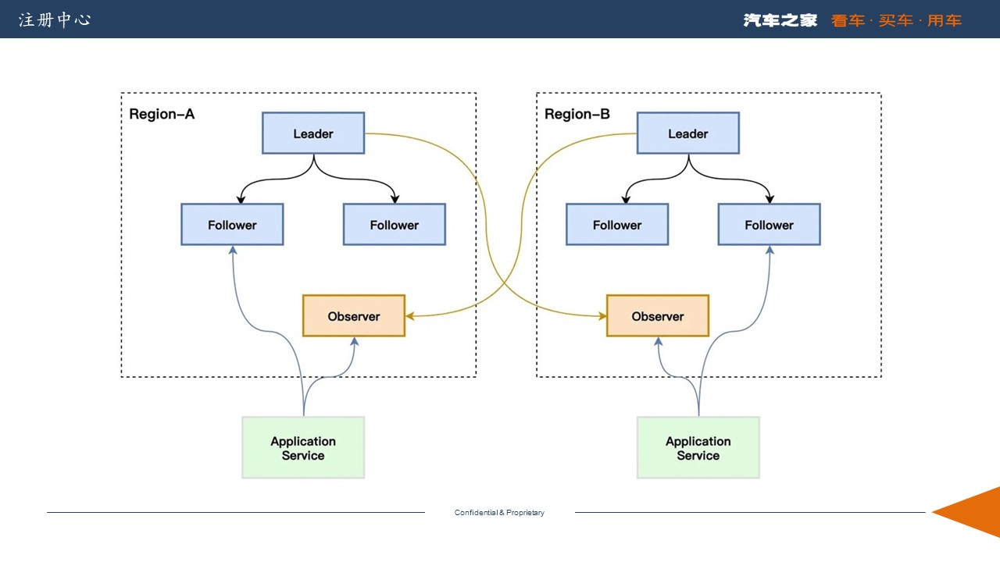
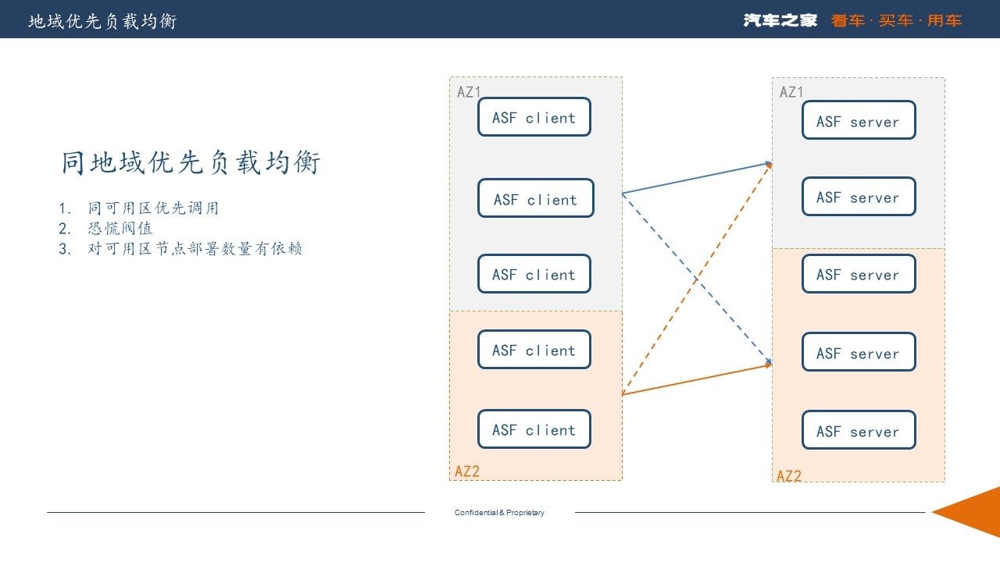
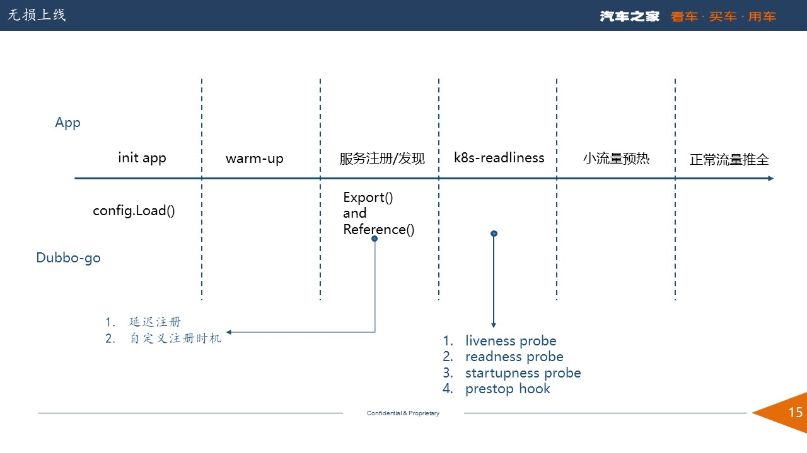

# 1. ASF 是什么

之家云微服务平台**ASF（AutoHome Service Framework**），提供服务注册和发现、服务治理、可观测、动态配置等能力，致力于帮助之家用户一站式构建微服务体系以及服务上云的能力。

ASF1.0 主要针对 Java 应用，支持使用 Dubbo 和 Spring Cloud 进行接入。随着业务的多元化发展，越来越多的用户选择使用 Go 语言和 gRPC 构建微服务，但是 gRPC 的服务注册/发现、负载均衡、健康检查等功能需要用户进行开发和维护，另外 gRPC 服务治理能力也比较弱。在ASF 2.0 中我们增加了对 Dubbo-go 的支持，将上述复杂的功能沉淀到平台侧，为 Java 和 Go 提供了统一的、标准的服务治理能力，极大的降低了使用 Go 语言构建微服务的成本。本篇文章主要介绍之家云 ASF 在使用 Dubbo-go 构建微服务并进行大规模服务治理时的探索和实践。

# 2. ASF 的架构

如下图所示，深蓝色虚线框内为 ASF 提供的主要功能，绿色虚线框是即将要交付的功能。


# 3. ASF 的特点和优势

## 3.1. 从gRPC平滑迁移到ASF

ASF 支持用户从 gRPC 无缝迁移到 ASF，业务代码基本不需要变化，迁移的风险和成本都控制在非常小的范围之内。迁移到 ASF 之后用户无需关注服务注册/发现等，只需要关心业务逻辑和 ASF 配置即可。接下来我们演示下 gRPC  server 如何迁移到 ASF-go server。

### 3.1.1. gRPC server 

1. 下载 gRPC pb插件，生成 pb.go 文件。

2. 编写服务端代码

```go
const (
   port = ":50051"
)

type SpecialService struct {
   pb.UnimplementedSpecialServer

}

func (s *SpecialService) Call(ctx context.Context, req *pb.SpecialRequest) (reply *pb.SpecialReply, err error) {
   fmt.Printf("req: %v\n", req)
   return &pb.SpecialReply{Message: "Hello ASF Go : " + port}, nil
}

func main() {
   lis, err := net.Listen("tcp", port)
   if err != nil {
      log.Fatalf("failed to listen: %v", err)
   }
   // 注册到grpc
   s := grpc.NewServer()
   protobuf.RegisterGreeterServer(s, &SpecialService{})
   if err := s.Serve(lis); err != nil {
      log.Fatalf("failed to serve: %v", err)
   }
}
```
### 3.1.2.  ASF-go server

1. 下载 dubbo-go pb 插件，生成 pb.go 文件（ASF 需要下载 ASF专用 pb 插件）。

```
go get -u github.com/apache/dubbo-go/protocol/grpc/protoc-gen-dubbo@v1.5.7
```

2. 编写服务端代码

```go

// 注册到dubbo-go
func init() {
   config.SetProviderService(NewSpecialService())
}

------ 迁移部分---
type SpecialService struct {
   *pb.SpecialProviderBase
}

func NewSpecialService() *SpecialService {
   return &SpecialService{
      SpecialProviderBase: &pb.SpecialProviderBase{},
   }
}
------ 迁移部分---

// 业务代码
func (s *SpecialService) Call(ctx context.Context, req *pb.SpecialRequest) (reply *pb.SpecialReply, err error) {
   fmt.Printf("req: %v\n", req)
   return &pb.SpecialReply{Message: "Hello ASF Go : " + port}, nil
}
```
3. 声明配置

```yaml
services:
  "specialProvider": # 服务的唯一标识，pb中自动生成
    version: 1
    group: "demo"
    protocol: "grpc"
    interface: "asf.smc.cloud.base.special"
	cluster: failover # 集群容错策略
	loadbalance: random # 负载均衡策略
```

## 3.2. Dubbo-go 配置优化

Dubbo-go 1.5.7 提供了一种声明式的配置方式，通过yaml文件配置应用信息、注册中心信息、以及导出服务和引入服务，针对 consumer 和 provider 需要单独在各自的配置文件中配置，然而对于大部分服务化应用来说它既是 provider 也是 consumer。这导致一个应用需要配置两份配置文件，对用户不是很友好，增加了用户的接入的复杂度（见issuse#1140）。另外对于一些应用级别的配置，例如应用信息、注册中心信息等需要重复配置，同时在解析yaml文件的时侯会生成两份实例，消耗了额外的内存。

基于以上问题，ASF 增加了一个聚合配置`CompositeConfig`，代码如下：

```go
type CompositeConfig struct {
   ProviderConfig *ProviderConfig             `yaml:"provider" json:"provider,omitempty" property:"provider"`
   ConsumerConfig *ConsumerConfig             `yaml:"consumer" json:"consumer,omitempty" property:"consumer"`
   Services       map[string]*ServiceConfig   `yaml:"services" json:"services,omitempty" property:"services"`
   References     map[string]*ReferenceConfig `yaml:"references" json:"references,omitempty" property:"references"`
}
```

`CompositeConfig` 聚合了 provider 和 consumer 的配置，并且抽象出了 consumer 和 provider 语义，如下：

```yaml
consumer:
 check: false # 关闭启动时检查
provider:
 filter: "echo" # provider 启动的过滤器
```

此外，dubbo-go 支持使用三种方式加载配置文件以适应不同的场景 ：

1. 环境变量

```shell
export CONF_PROVIDER_FILE_PATH="../profiles/dev/server.yml"
export CONF_CONSUMER_FILE_PATH="../profiles/dev/server.yml"
export APP_LOG_CONF_FILE="../profiles/dev/log.yml"
```

2. flag 指定

```shell
## 生产者
go run . -proConf ../profiles/dev/server.yml -logConf ../profiles/dev/log.yml
## 消费者
go run . -conConf ../profiles/dev/client.yml -logConf ../profiles/dev/log.yml
```

3. ConfigPostProcessor 

```go
   // 服务提供方配置
   PostProcessServiceConfig(*common.URL)
   

   // 服务消费方配置
   PostProcessReferenceConfig(*common.URL)
```

在此基础上 ASF 又提供了通过代码直接指定配置文件路径和默认日志级别的方式，为用户在使用物理机和容器部署时提供了更加多元化的选择和更加易于管理配置的方式。如下

```go
config.LoadWithConfig(&common.AsfConfig{
   CompositeConf: "./asf-grpc/server/server.yml",
   Level: "debug",
})
```

### 3.2.1. 支持使用 Fluent API 的引导类

更进一步地 ASF 提供了使用 Fluent API 的引导类。

```go
providerExportedHook := config.NewProviderExportedHook(func(event observer.Event) {
       logger.Infof("provider exported %s", event.GetTimestamp().Format("3006-01-02 15:04:05"))
})

consumerReferencedHook := config.NewConsumerReferencedHook(func(event observer.Event) {
     logger.Infof("consumer referenced %s", event.GetTimestamp().Format("3006-01-02 15:04:05"))
})

bootstarp := config.NewAsfBootstarp().
       AddProviderExportedHook(providerExportedHook).
       AddConsumerReferencedHook(consumerReferencedHook).
       ConfigPath("./asf-grpc/server/server.yml").
       LoadConfig(). // 加载配置
       // DelayExport(true). // 加载配置后 配置延迟暴露
       Start()
```


## 3.3. 服务契约

dubbo-go 和 dubbo 一样支持导出服务的元数据，通过元数据我们可以查看服务的一些基本信息。通过服务的元数据 **ASF 提供了 服务查询、服务Mock、服务测试（开发中）等功能**。在元数据格式上 dubbo-go 和 dubbo 有些许不同，ASF 对齐了dubbo-go 和 dubbo 的元数据。

例如，通过 ASF 控制台可以查看服务（接口）所属的应用，提供者和消费者数量、语言类型、最后一次发布时间，如下图：


查看服务提供者/消费者IP地址、所在集群（Availability Zone）、接口的元数据（方法名、参数列表、返回值，如下图：


## 3.4. 服务治理

### 3.4.1. 注册中心高可用

注册中心我们依旧使用的是 Zookeeper（以下简称 ZK），而 Zk 使用的是基于Leader的单点写一致性协议（ZAB 协议），所以无法通过水平扩展来增加注册中心的写性能。另外当集群中 Follow 服务器数量逐渐增多，集群处理创建数据节点等事务性请求操作的性能就会逐渐下降。这是因为集群在处理事务性请求操作时，要在集群中对该事务性的请求发起投票，只有超过半数的 Follow 服务器投票一致，才会执行该条写入操作，然后才会向客户端做出响应。所以在[ZK 跨地域部署上](https://mp.weixin.qq.com/s/05-ko4KyeHOTkrAbl8dQwQ "跨地域场景下，如何解决分布式系统的一致性？")我们采用了 **多服务+Partition&单地域部署+Learner**的部署方式，结合dubbo-go 和 dubbo 的多注册中心机制（multiple-registry）来保证ZK跨地域部署时较高的可用性和较高的写入效率。



### 3.4.2. 区域优先负载均衡

在 dubbo 和 dubbo-go 中利用多注册中心（multiple-registry）集群可以实现[注册中心集群间的负载均衡](https://dubbo.apache.org/zh/blog/3019/06/32/%E4%BD%BF%E7%94%A8-dubbo-%E8%BF%9E%E6%8E%A5%E5%BC%82%E6%9E%84%E5%BE%AE%E6%9C%8D%E5%8A%A1%E4%BD%93%E7%B3%BB/#dubbo-%E4%BD%93%E7%B3%BB%E5%86%85%E7%9A%84%E5%A4%9A%E5%8D%8F%E8%AE%AE%E5%A4%9A%E6%B3%A8%E5%86%8C%E4%B8%AD%E5%BF%83%E6%9C%BA%E5%88%B6 "dubbo 多注册中心负载均衡")，即根据注册中心所在的 AZ 可实现节点的区域优先负载均衡，原理如下图：


下面是dubbo在使用多注册中心时provider的配置示例，

```properties
dubbo.protocol.name=dubbo
dubbo.protocol.port=12345

dubbo.config.multiple=true
dubbo.registry.id=mbp
dubbo.registry.address=nacos://192.168.1.31:8848
dubbo.registry.zone=mbp
dubbo.registry.use-as-config-center=false
```

可以看出在 dubbo 中要使用区域优先负载均衡必须依赖多注册中心模式，然而当服务规模比较小时，注册中心并不一定部署了多个集群，注册中心和应用也可能没有在一个可用区当中（Availability Zone，AZ）。在这种情况下节点就没有办法使用同 AZ 优先的负载均衡策略了。

此外，一个应用如果部署在不同的AZ中，需要按 AZ 配置好`dubbo.registry.zone`属性，在发布应用的时候需要按照 AZ 加载不同的配置文件，步骤相当的繁琐。

基于以上问题，ASF 通过 CMDB 在应用启动的时候自动获取 IP 所在 AZ 并在注册中心URL中进行标记，无需用户手工配置。将应用所在 AZ 和注册中心解绑（不依赖具体注册中心、注册中心部署方式），灵活性更高。

在 dubbo 的负载均衡处理逻辑中，也存在一些问题。

1. 上游集群 AZ 节点数量分布不均匀。假设 provider A 部署在 AZ1 和 AZ2 中，但是AZ1 中只有1个可用实例，而 AZ2 中有5个。在这种场景下会导致 AZ1 中的 consumer 的所有流量都路有到 AZ1 中的那一个实例上。

   ASF 在负载均衡逻辑中增加了**恐慌阀值**判断，当 AZ / Region < 30% 的时候直接在 Region 所有可用实例进行路由，这样就可以保证不会把流量集中到过少的节点，导致服务处于“雪崩”的状态。
   
2. 如下图所示，始发集群 AZ 节点数量大于上游集群 AZ 节点数量。AZ1 中的 consumer 节点数量远大于 AZ1 的provider 数量，此时如果将流量全部路由到 AZ1 中的 provider 会导致明显的负载均衡不均匀，因此我们需要将多余的流量路由到 AZ2。




### 3.4.3. 只注册和服务禁用

ASF 控制台提供了服务禁用功能，当实例负载较高的时候，可通服务禁用功能对实例进行手工下线，待负载恢复正常后再执行上线。


# 3.5. 可观测性

下图为 ASF 服务监控图表：


dubbo-go 的 metrics 模块提供了基于Prometheus 的 metrics 采集，ASF 基于 dubbo-go 的metrics 进行了重新设计：

1. **支持使用 push 模式进行数据上报**，因为 pull 模式需要 prometheus 支持服务发现，而一些主流的注册中心，比如naocs 还不支持 prometheus。额外暴露一个 port，端口的安全策略也需要保证。若同一个 IP 部署了多个应用，则会导致 port 难以获取，实现起来比较复杂。

2. **去掉了 Summary **, 在Prometheus中，Histogram 会预先划分若干个**bucket**，Histogram **不会保存数据采样点值，每个bucket只记录落在本区间样本数的counter**，即histogram存储的是区间的样本数统计值，在服务端（prometheus）我们可以通过 [histogram_quantile()](https://prometheus.io/docs/prometheus/latest/querying/functions/#histogram_quantile "histogram_quantile") 函数来计算分位数，因此比较适合高并发的数据收集。而 Summary 则在客户端 直接存储了 quantile 数据，不适合高并发的场景。

3. **使用 Histogram 重要的是 bucket 的划分**，bucket 太多了或者太少了都不行，而 dubbo-go 提供的划分比较简单。ASF 参考了 micrometer [PercentileHistogramBuckets](https://github.com/micrometer-metrics/micrometer/blob/main/micrometer-core/src/main/java/io/micrometer/core/instrument/distribution/PercentileHistogramBuckets.java "PercentileHistogramBuckets")的划分算法，这个算法是Netfix根据经验值而划分的，预先生成了 1ms-60s 的72个桶。

4. 优化了 dubbo-go 的 metrics，根据谷歌的黄金法则 ASF 采集的指标可以计算，服务的RT、QPS、请求的成功/失败比率、饱和度（dubbo-go协程数量，暂时没有采集）、TP99（反映[尾部延迟](https://engineering.linkedin.com/performance/who-moved-my-99th-percentile-latency "who-moved-my-99th-percentile-latency")）。


# 4. 未来规划

本文对之家云 ASF 落地 dubbo-go 做了阶段性的总结。目前ASF已经托管 6 个 go 应用和 50+ java 应用，上千加节点。随着 K8S 的落地以及服务规模不断的扩大，微服务中间件也迎来了新的挑战，即帮助用户平滑稳定地、低成本迁移上云以及解决上云之后带来的问题。

## 4.1. 自适应的负载均衡

1. 上云后 K8S 管理的 Node 的性能不均衡，新机器的性能好老机器的性能差，尤其是在大促的时候会增加很多的新机器。而 K8S 在调度Pod的时候是随机的，我们的期望是性能好的、新的机器处理更多的流量，而性能差的、老的机器处理少量的流量，所以简单的轮询算法（Round Robin）和随机（Random）算法并不能满足我们上云之后的需求。

2. 针对第一个问题，我们可以使用加权轮随机算法（Weight Round Robin），加权最小活跃数算法(LeastActive)。 然而 dubbo 的负载均衡算法不支持动态修改权重，需要人工运维，并且最小活跃数算法存在“羊群效应”，极端情况下性能好的机器将处理所有流量，性能差的机器没有流量。

3. 故障自愈能力，我们希望负载均衡算法能够自动摘除故障的节点，并具备故障自愈能力。


针对上述问题，我们希望负载均衡算法能做到以下几点：

1. 具备故障摘除和故障自愈能力。
2. 无需人工干预，可以自动根据延迟、provider 负载等指标自动评估权重。

**P2C（Pick Two Random Choices）算法**，P2C 有更科学的负载均衡策略，它通过随机选择两个节点，然后对比节点的 CPU 负载，延时等指标，在这俩节点里选择更优的节点来避免`羊群效应`，并通过`指数加权移动平均算法（EWMA）`统计节点的实时状态，从而做出最优选择。诸如 [Linkerd](https://linkerd.io/3.10/features/load-balancing/ "知名的服务网格项目")、[Rsocket](https://rsocket.io/ "Netfix 开源的基于响应式编程的应用层协议") 等知名项目，都采用的是P2C负载均衡算法。

在 P2C 算法中每个节点会包含以下指标：

1. **active** 客户端正在等待响应的请求数。
2. **cpuLoadAverage** provider 节点的cpu 负载
3. **weight** 静态权重
4. **latency** 请求的指数加权移动平均延迟
3. **availabilityPercentage** 请求的指数加权移动平均成功率

### EWMA (指数加权移动平均算法）


`vt`代表第t次请求的指数加权值，`vt-1`代表上次请求的指数加权平均值，`θt`代表第t次请求的值。

在统计 latency 和 availabilityPercentage 为什么要使用 EWMA 算法，主要有以下几点原因：

1. 算数平均算法对网络耗时不敏感, 而 `EWMA`可以在网络波动时适当`降低β的值`，使其快速感知到波动的存在，当网络波动结束后，适当`提升β的值`，这样就可以在网络稳定的情况下较好的反映一个区段内的均值情况。

2. 对于 `request-response` 交互模型来说，使用算数平均算法计算节点权重，因为信息滞后会产生“羊群效应”。

3. `EWMA`算法不需要保存过去的所有值，计算量小，并且节省内存。

> 在实际的测试中，我们发现在request-response模型中，EWMA 算法对频繁的网络波动场景下并没有达到预期的效果，并且在另外的一些框架中P2C算法也存在预热问题。我们将会联合 dubbo-go 社区共同完善 P2C 算法的实现，并在柔性服务上做出更多的探索。

## 4.2. 无损上线

dubbo（or dubbo-go）在启动时（spring 容器启动/config.Load()加载）即会引用服务也会暴露服务，但是在生产环境中我们往往需要做一些预热操作（例如 mysql、redis连接池的初始化等），等到预热操作结束后或者 k8s 的`readinessProbe` 再去暴露服务。否则再上线时可能会出现大量的调用错误。




在 dubbo 中我们可以使用`延迟暴露`和`Qos`来解决上述问题，但是延迟暴露依赖于一个经验值，而QOS则依赖于发布系统，似乎都不是很完美。未来在 ASF 中将可以直接通过Bootstarp做到无损上线，实例如下：


```go
providerExportedHook := config.NewProviderExportedHook(func(event observer.Event) {
        logger.Infof("provider exported %s", event.GetTimestamp().Format("3006-01-02 15:04:05"))

    })

consumerReferencedHook := config.NewConsumerReferencedHook(func(event observer.Event) {
        logger.Infof("consumer referenced %s", event.GetTimestamp().Format("3006-01-02 15:04:05"))

    })

bootstarp := config.NewAsfBootstarp().
        AddProviderExportedHook(providerExportedHook).
        AddConsumerReferencedHook(consumerReferencedHook).
        ConfigPath("./asf-grpc/server/server.yml").
        LoadConfig(). // 加载配置
        DelayExport(true). // 加载配置后 配置延迟暴露
        Start()

time.Sleep(time.Second * 5) // wanm-up

bootstarp.StartProvider() // 暴露服务
```

最后，我们将不断和 dubbogo 等社区合作，争取将 ASF 打造为一款易用地、稳定的、高性能的微服务治理平台，并把我们的经验反馈到开源社区。