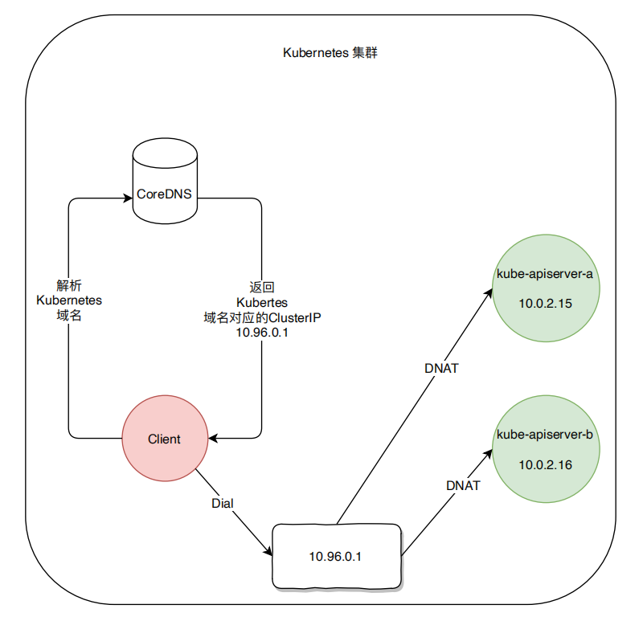
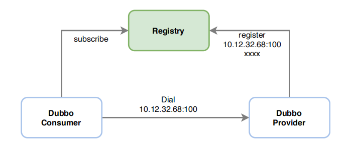
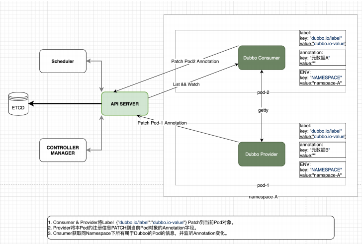

# dubbo-go 中将 Kubernets 原⽣作为注册中⼼
的设计和实现

随着云原⽣的推⼴，越来越多的公司或组织将服务容器化，并将容器化后的服务部署在 Kubernetes 集群

中。

今天这篇⽂章将会介绍 dubbo-go 将 Kubernetes 作为注册中⼼的服务注册的初衷、设计⽅案，以及具体实现。

到⽬前为⽌该⽅案的实现已经被合并到 dubbo-go 的 master 分⽀。具体实现为关于 Kubernetes 的 
PullRequest 。

## Kubernetes管理资源的哲学
Kubernetes 作为容器集群化管理⽅案管理资源的维度可主观的分为服务进程管理和服务接⼊管理。

- 服务实例管理，主要体现⽅式为 Pod 设计模式加控制器模式，控制器保证具有特定标签
（ Kubernetes-Label ）的 Pod 保持在恒定的数量（多删，少补）。

- 服务管理，主要为 Kubernetes-Service ，该 Service 默认为具有特定标签（ Kubernetes-Label ）的
Pod 统⼀提供⼀个 VIP（ Kubernetes-ClusterIP ）所有需要请求该组 Pod 的请求都默认会按照 round-robin 的负载策略转发到真正提供服务的 Pod 。并且 CoreDNS 为该 Kubernetes-Service 提供集群内唯⼀的域名。

## Kubernetes的服务发现模型
为了明确 Kubernetes 在服务管理提供的解决⽅案。我们以 kubernetes Api-Server 提供的 API (HTTPS) 服

务为例。Kubernetes 集群为该服务分配了⼀个集群内有效的 ClusterIP ，并通过 CoreDNS 为其分配了唯

⼀的⼀个域名 **kubernetes **。如果集群内的 Pod 需要访问该服务时直接通过 **kubernetes **即可完成。

具体流程如上图所示 ( 红⾊为客户端，绿⾊为 kube-apiserver )：

1. ⾸先客户端通过 CoreDNS 解析域名为 **kubernetes **的服务获得对应的 Cluster IP 为 10.96.0.1。

1. 客户端向 10.96.0.1 发起 HTTP 请求。

1. HTTP 请求 kube-proxy 所创建的 IP tables 拦截随机 DNAT 为 10.0.2.16 或者 10.0.2.15 。

1. Client 与最终提供服务的 Pod 建⽴连接并交互。


由此可⻅，Kubernetes 提供的服务发现为域名解析级别。


## dubbo 的服务发现模型
同样为了明确 dubbo 服务发现的模型，以⼀个简单的 dubbo-consumer 发现并访问 Provider 的具体流

程为例。

具体流程如上图所示：

1. Provider 将本进程的元数据注册到 Registry 中，包括 IP，Port，以及服务名称等。

1. Consumer 通过 Registry 获取 Provider 的接⼊信息，直接发起请求


由此可⻅，dubbo 当前的服务发现模型是针对 Endpoint 级别的，并且注册的信息不只 IP 和端⼝包括其他

的⼀些元数据。
## 无法直接使用 Kubernetes 服务发现模型的原因
通过上述两个⼩节，答案基本已经⽐较清晰了。总结⼀下，⽆法直接使⽤ Kubernetes 作为注册中⼼的原

因主要为以下⼏点:

1. Kubernetes-Service 标准的资源对象具有的服务描述字段 中并未提供完整的 dubbo 进程元数据字段因此，⽆法直接使⽤Kubernetes-Service 进⾏服务注册与发现。

1.  dubbo-go 的服务注册是基于每个进程的，每个 dubbo 进程均需进⾏独⽴的注册。

1.  Kubernetes-Service 默认为服务创建 VIP，提供 round-robin 的负载策略也与 dubbo-go⾃有的 Cluster 模块的负载策略形成了冲突。

## Dubbo-go 所采⽤的注册/发现⽅案
### 服务注册
Kubernetes 基于 Service 对象实现服务注册／发现。可是 dubbo 现有⽅案为每个 dubbo-go 进程独⽴注册，因此 dubbo-go选择将该进程具有的独有的元数据写⼊运⾏该 **dubbo-go **进程的 **Pod **在 **Kubernetes
**中的 **Pod **资源对象的描述信息中。每个运⾏ dubbo 进程的 Pod 将本进程的元数据写⼊ Kubernetes-Pod
Annotations 字段。为了避免与其他使⽤Annotations 字段的 Operator 或者其他类型的控制器（ Istio ）
的字段冲突。dubbo-go 使⽤ Key 为 **dubbo.io/annotation **value 为具体存储的 K/V 对的数组的 json 编码后的 base64 编码。

样例为：
```
apiVersion: v1
kind: Pod
metadata:
 annotations:
 dubbo.io/annotation:
W3siayI6Ii9kdWJibyIsInYiOiIifSx7ImsiOiIvZHViYm8vY29tLmlrdXJlbnRvLnVzZXIuVXNlcl
Byb3ZpZGVyIiwidiI6IiJ9LHsiayI6Ii9kdWJiby9jb20uaWt1cmVudG8udXNlci5Vc2VyUHJvdmlk
ZXIvY29uc3VtZXJzIiwidiI6IiJ9LHsiayI6Ii9kdWJibyIsInYiOiIifSx7ImsiOiIvZHViYm8vY2
9tLmlrdXJlbnRvLnVzZXIuVXNlclByb3ZpZGVyIiwidiI6IiJ9LHsiayI6Ii9kdWJiby9jb20uaWt1
cmVudG8udXNlci5Vc2VyUHJvdmlkZXIvcHJvdmlkZXJzIiwidiI6IiJ9LHsiayI6Ii9kdWJiby9jb2
0uaWt1cmVudG8udXNlci5Vc2VyUHJvdmlkZXIvY29uc3VtZXJzL2NvbnN1bWVyJTNBJTJGJTJGMTcy
LjE3LjAuOCUyRlVzZXJQcm92aWRlciUzRmNhdGVnb3J5JTNEY29uc3VtZXJzJTI2ZHViYm8lM0RkdW
Jib2dvLWNvbnN1bWVyLTIuNi4wJTI2cHJvdG9jb2wlM0RkdWJibyIsInYiOiIifV0=
```
由于每个 dubbo-go 的 Pod 均只负责注册本进程的元数据，因此 Annotations 字段⻓度也不会因为运⾏
dubbo-go 进程的 Pod 数量增加⽽增加。

### 服务发现
依赖kubernetes Api-Server 提供了Watch的功能。可以观察特定namespace内各Pod对象的变化。

dubbo-go为了避免dubbo-go进程watch到与dubbo-go进程⽆关的Pod的变化，dubbo-go将watch的

条件限制在当前Pod所在的namespace，以及 watch 具有 Key为**dubbo.io/label** Value为 **dubbo.io**
**value **的Pod。在Watch到对应Pod的变化后实时更新本地Cache，并通过Registry提供的Subscribe通

知建⽴在注册中⼼之上的服务集群管理，或者其他功能。
 
### 总体设计图

具体流程如上图所示：

1. 启动 dubbo-go 的 Deployment 或其他类型控制器使⽤ Kubernetes Downward-Api 将本 Pod 所在
namespace 通过环境变量的形式注⼊ dubbo-go 进程。

1. dubbo-go 进程的 Pod 启动后通过环境变量获得当前的 namespace 以及该 Pod 名称，调⽤
Kubernetes-Apiserver PATCH 功能为本 Pod 添加 Key 为 **dubbo.io/label** Value为 **dubbo.io-value
**的label。

1. dubbo-go 进程调⽤ Kubernetes-Apiserver 将本进程的元数据通过 PATCH 接⼝写⼊当前 Pod 的
Annotations 字段。

1. dubbo-go 进程 LIST 当前 namespace 下其他具有同样标签的 Pod，并解码对应的 Annotations 字段
获取其他 Pod 的信息。

1. dubbo-go 进程 WATCH 当前 namespace 下其他具有同样标签的 Pod 的 Annotations 的字段变化。

## 总结
Kubernetes 已经为其承载的服务提供了⼀套服务发现，服务注册，以及服务集群管理机制。⽽ dubbo-go 的同时也拥有⾃成体系的服务集群管理。这两个功能点形成了冲突，在⽆法调谐两者的情况。dubbo-go 选择保持⾃有的服务集群管理系，放弃 Kubernetes-Service 功能，将元数据直接写⼊到
Kubernetes Pod 内。依赖 Kubernetes 提供的 Watch 功能提供维护服务集群状态。


