# 要优雅退出吗？dubbogo给你

## dubbogo

[Apache Dubbo](http://dubbo.apache.org/en-us/)是由阿里开源的一个`RPC`框架，而[dubbogo](https://github.com/apache/dubbo-go)则是相对应的`go`语言版本：

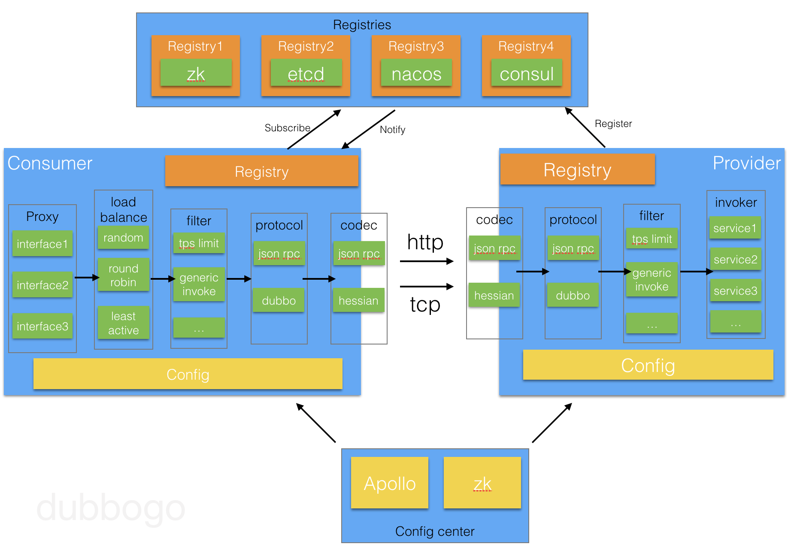

今天我们来讨论一下`dubbogo`里面实现的优雅退出。该功能的`PR`是`https://github.com/apache/dubbo-go/pull/255`。

当我们讨论优雅退出的时候，最基本的要求是自动无损停机。它同时强调了自动和无损两个方面。

首先是自动，而与自动对应的则是手动了。手工介入的缺陷是显而易见的，它要求我们在应用下线的时候手动摘掉流量。这一步可以通过网关、负载均衡或者注册中心来实现。它还容易忘和出错，如果这个东西还要求到运维身上，那就真的是下个线都得求爷爷告奶奶，开发体验十分不好。

而无损，关键则是，正在执行的事情要能执行完。这个“事情”含义会非常广泛，比如说发出去的请求我要能收回响应；收到的请求要执行完毕并且给人家返回响应……如果更加严格的来说，那么本地启动的定时任务，或者分布式事务，都应该在完成之后才能关机。

## 设计

我们先来看一下，一般情况下关机会发生什么：

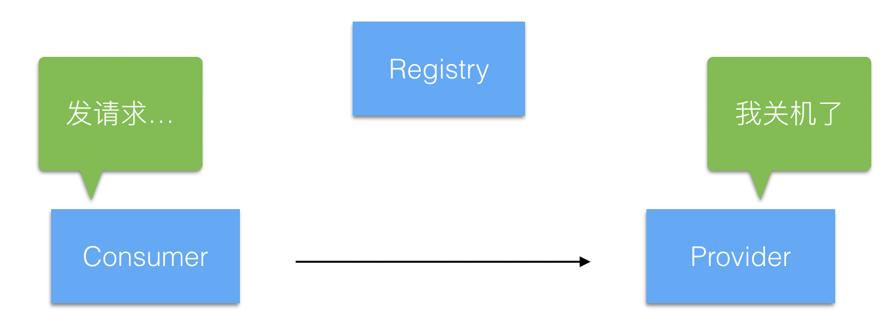

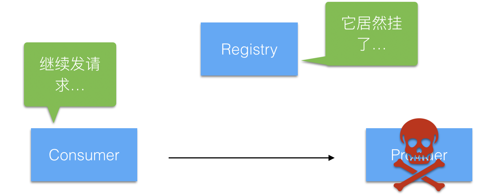

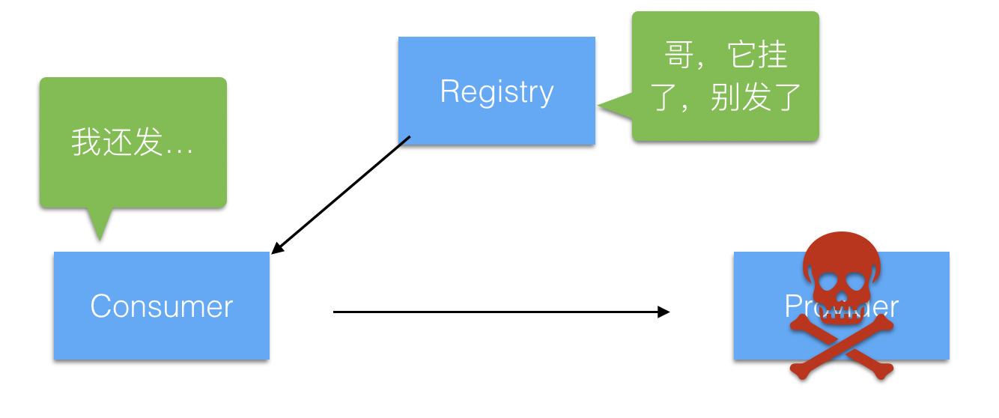

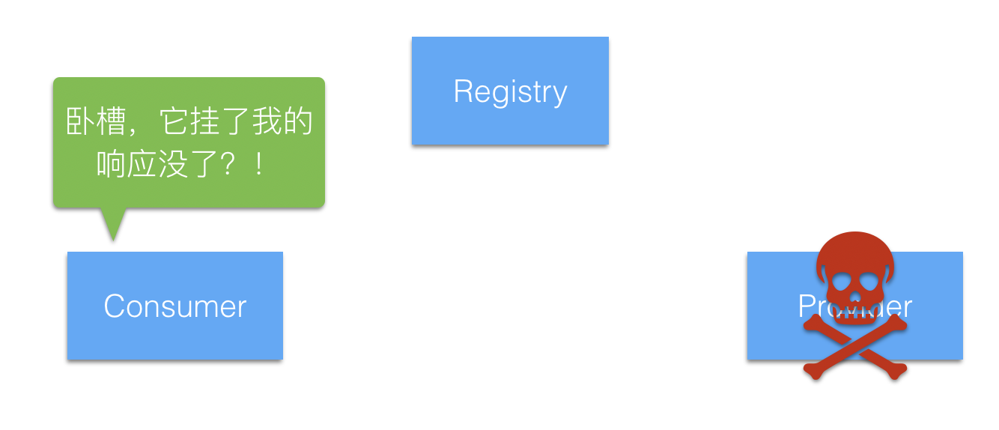

这里面可以看出来，如果没有优雅退出机制的话，服务器是很任性的，谁都不说咔嚓一下关了。

然后注册中心隔了一小会之后，通过心跳检测或者监听到服务器跪了，心里卧槽一句之后，就赶紧通知客户端。这个过程，客户端这个傻白甜还是使劲发请求。

它收到注册中心的通知之后，就懵逼了，心里一万句MMP飘过之后，终于接受了自己刚才发出去的一些请求，收不到响应了的事实。

如果要是客户端咔嚓一下关机呢？

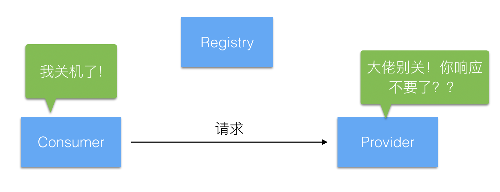

所以我们可以看到，不论是客户端突然关机还是服务端突然关机，都会造成问题。

于是我们的优雅关机，就是要解决这么一个问题。从前面的那些图也可以看到，如果要优雅退出，那就得好好商量：

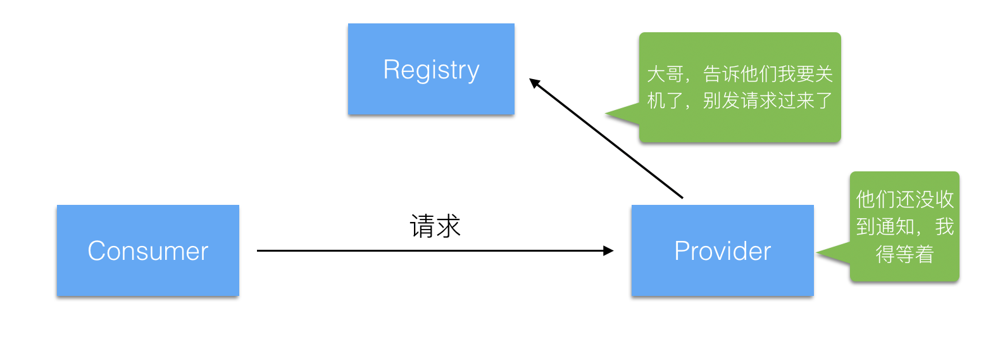

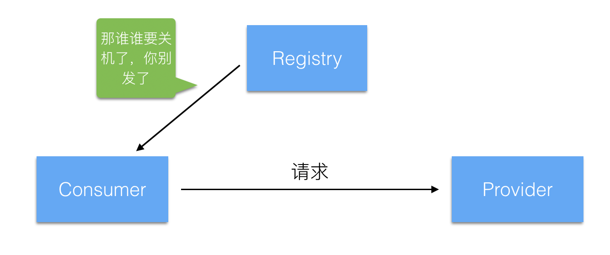

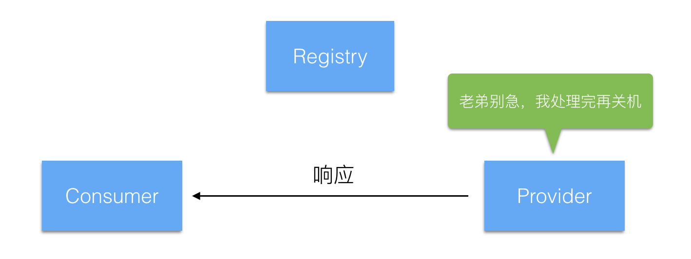

如果客户端关机呢？那就更加简单了，稍微停一下，把发出去的请求的响应收完再关机。

现实的情况是，一个节点，往往既是服务端，也是客户端。这种情况下该怎么搞？首先在发出关机的信号后，它肯定不能关掉，至少要等到已接受的请求处理完成，才能关掉。往往是，处理一个请求会导致它作为客户端发起一个调用。于是我们可以看到，在该节点既是服务端，又是客户端的情况下，要先关闭作为服务端的功能，这样才能防止因为要处理新的请求而不得不作为客户端向别的服务器发起请求。

所以最终步骤就是：
1. 告知注册中心，即将关闭，此时等待并处理请求；
2. 注册中心通知别的客户端，别的客户端停止发送新请求，等待已发请求的响应；
3. 节点处理完所有接收到的请求并且返回响应后，释放作为服务端相关的组件和资源；
4. 节点释放作为客户端的组件和资源；

## 实现

### 如何知道关机？

不管我们如何实现优雅关机，第一个要解决的就是，我怎么知道这个节点要关机了？在Java虚拟机里面，有`Runtime`提供了`addShutdownHook`的方法：

golang就没这个便利。好在`golang`提供了信号(Signal)机制。在golang里有一个`os/signal`的包，它是一个对操作系统信号的封装——所以这是一个操作系统相关的东西，不过我这里只考虑`Unix-Like`系统，毕竟我还是不怎么听说有人在`Windows`上部署`golang`微服务的[手动狗头]。

`golang`的文档(https://golang.org/pkg/os/signal/)里面有很详细的描述。我大概总结一下：
1. `SIGKILL`和`SIGSTOP`可能捕捉不到；
2. `SIGHUP`，`SIGINT`和`SIGTERM`会导致系统退出；
3. `SIGQUIT`，`SIGILL`，`SIGTRAP`，`SIGABRT`，`SIGSTKFLT`，`SIGEMT`，`SIGSYS`会导致系统退出，并且打印此时的栈；

所以我们只需要监听这些信号的处理就可以了。

### 释放资源步骤

前面我们讨论了关机释放资源所需要按序执行的步骤，那么落地到`dubbogo`里面该如何实现呢？

从`dubbogo`的源码能够发现，关键的组件就是`Registry`和`Protocol`。

其中`Protocol`从逻辑上来说，可以分成供`Provider`使用的`Protocol`和供`Consumer`使用的`Protocol`。当然，`Protocol`也可能同时提供两者使用。因此我们考虑到这种情况，在销毁`Provider`的`Protocol`的时候，要把共用的那些`Protocol`剔除出来。

按照我们的预先分析的步骤，释放资源的步骤应该是：

1. 销毁所有的`Registry`实例，这也就是从注册中心里面注销。这个过程，客户端因为有监听注册中心的事件，所以很快就能知道某个服务器已经不可用；

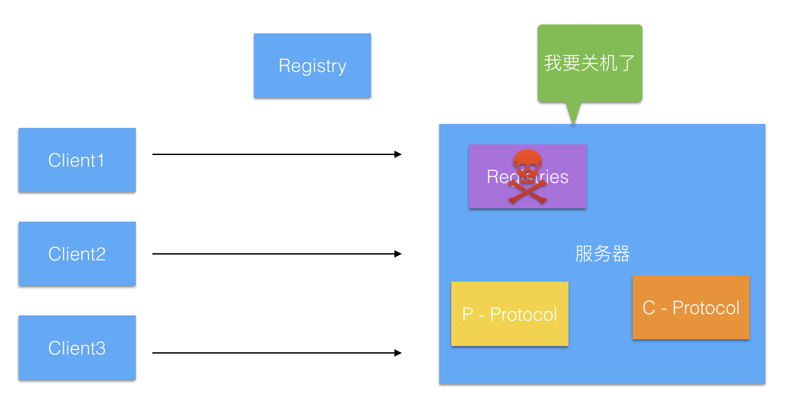

2. 在步骤1之后，理论上来说所有的客户端都不会再发请求过来了。但是还有很多时候，一个是注册中心通知客户端的延时，二是不同的客户端可能有一些奇怪的缓存机制，再一个就是此时正在发送的请求。这几种情况下，还会有部分请求到达服务器，所以服务器还需要接收这部分请求然后处理掉，因而要等待一段时间；

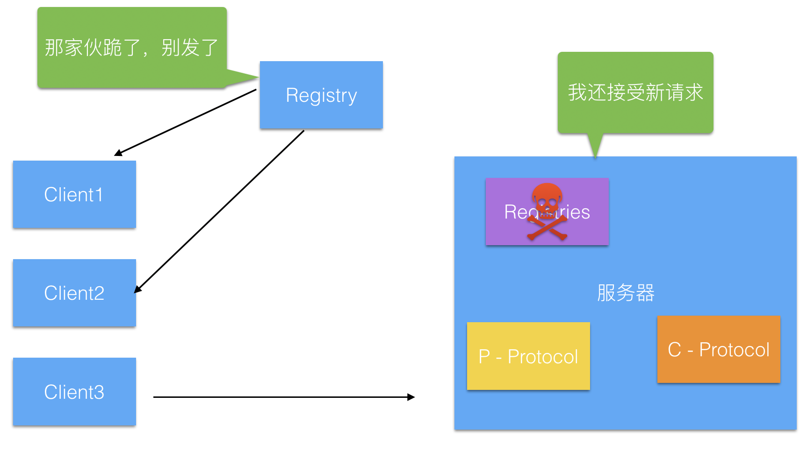

3. 在步骤2之后，绝大部分情况下，服务端就可以直接销毁掉扮演`Provider`的`Protocol`了。然而，如果步骤2等待时间过短，或者说客户端和注册中心就服务器下线这个事情达成一致的时间太长，那么这个阶段还会收到请求。这个时候我们就只能拒绝请求了。此时，我们还要判断一下，当前正在处理的请求处理完了没有，如果处理完了，或者等了一段时间之后都还没处理完，就进入下一个阶段；

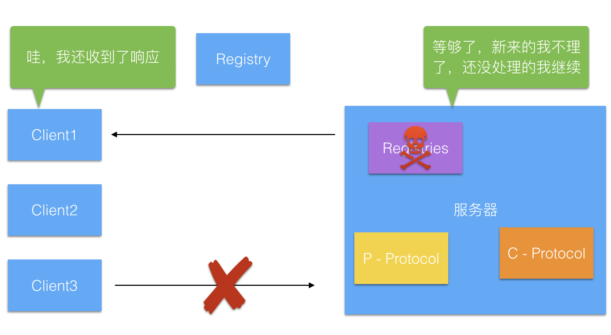

4. 在这个步骤，服务器才真的摧毁作为`Provider`的`Protocol`。

5. 经过步骤4，服务器还可能处在一种“虽然我无法响应别人，但是我还在处理点事情，我要等别人的响应”的状态中，所以这个时候我们再稍微停下来等一下，如果所有的响应都收到请求了，或者超时，进入下一个阶段；

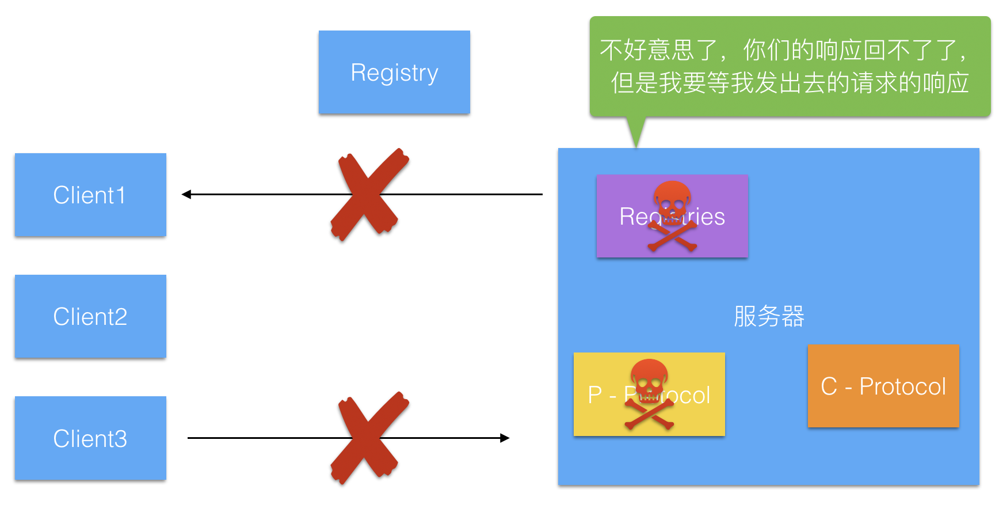

6. 摧毁掉剩下的`Protocol`。
7. 理论上来说，经过步骤6，在框架层面上，所有的资源都释放了。但是这个时候我们要考虑到开发者可能在此时需要释放他创建的资源，因此我们要提供一个回调机制，允许他们在这个时间节点回收资源；

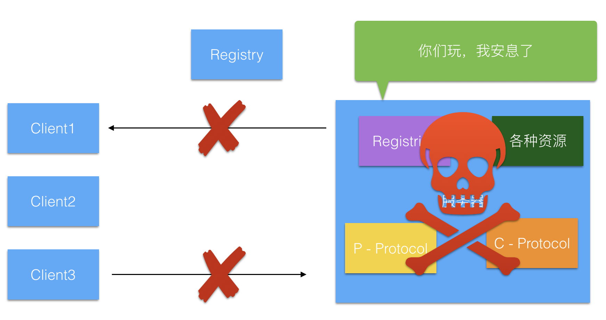

我们的源码里面很容易看出来这些步骤：

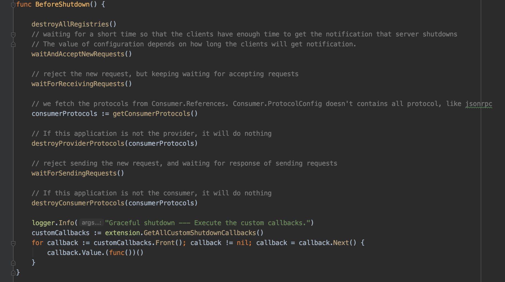

### 如何确定每一步的超时时间

在实现这个优雅退出的时候，有一个参数非常关键，就是每一步的退出时间`step_timeout`，它代表的是，在前面提及的每一个步骤，如果需要停下来等待，那么会在多久以后超时，结束等待。

在大大大大大多数情况下，设置这个时间只需要考虑第一个停下来等待的步骤，即服务端在宣称了自己要停机，并且销毁了`Registry`之后停下来等待新请求的时长。也就是执行方法`waitAndAcceptNewRequests`的超时时间。

有一个简单的式子可以描述这个时间：客户端收到注册中心通知的时长+请求响应时长。

第一个“客户端收到注册中心通知的时长”很好理解，但是也比较难估算。这主要取决于注册中心和客户端缓存机制。我个人经验是使用`ZK`的情况下，一般不会超过1秒。

第二个“请求响应时长”最复杂了。首先，这是一个从客户端观察的值。也就是说，它不是我们监控到的服务端的服务响应时间，而是从客户端发出一个请求到它收到完全响应的时长。于服务端而言，大概是“请求传输时长+服务响应时长+响应传输时长”。

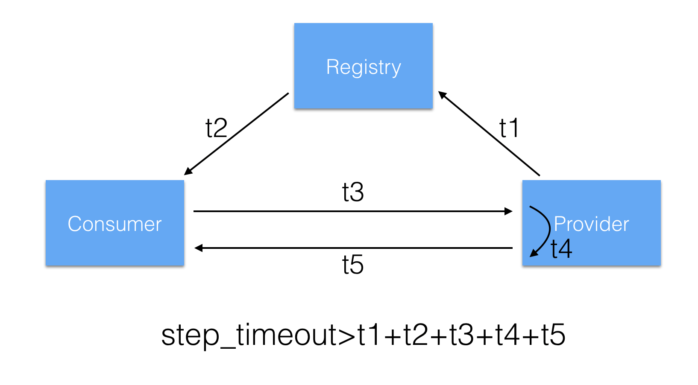

然后我们又会面临一个问题，一个服务端往往提供多个服务，我该取哪个服务的请求响应时长？答案是取决于你具体的业务和你的期望。开发者可以基于自己的服务的重要性，取比较重要的服务的999线；又或者全部服务一起考虑，取999线。这里我比较不建议使用平均线，因为平均线意味着有很多的请求无法再这个时间内返回响应。

另外一种比较罕见的选择是，使用定时任务的执行时间，或者事务——尤其是分布式事务——的完成时间。

核心就是，你觉得哪个东西最重要，你就用那个东西的执行时间。

上面的逻辑也适用于单纯是`Consumer`的应用。

大多数情况下，`step_timeout`默认值10秒足以应付了。

## 未实现部分

### 特殊回调

这个小标题有点不太准确。大家注意到的是，我只在所有框架资源都被销毁之后才会回调开发者注册的回调。这个时候就有这么一些问题：
1. 如果开发者在自定义的回调里面希望用到`dubbogo`的功能，特别是发起远程调用，那么显然是不可能的——虽然我也觉得不会有人会这么干；
2. 如果开发者的回调希望按照顺序来执行，那么也是不支持的。我们只会按照注册回调的顺序来依次调用。当然开发者可以通过将多个回调按序调用组成一个更复杂的回调来实现这个目标。不支持它主要是一个取舍问题。我相信有这种需求的人是少数以至于几乎没有的……

### 底层支持的优雅停机

前面所有的步骤，都是直接建立在应用层面上。实际上，还有一些业界的做法，是在底层协议上就直接提供了支持。比如说，通过`TCP`连接发送一个只读事件，那么客户端后续就自然不会再把请求发过来。

我们的优雅停机并没有使用到这一种机制，因为在应用层面上就能够解决。`dubbogo`里面的`Registry`和`Protocol`的`Destroy`都没采用这种机制。

但是这的确是一个很不错的实现思路。`dubbo`就是采用了这种方式。

