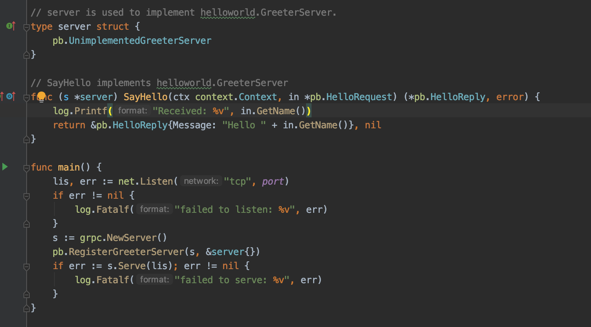
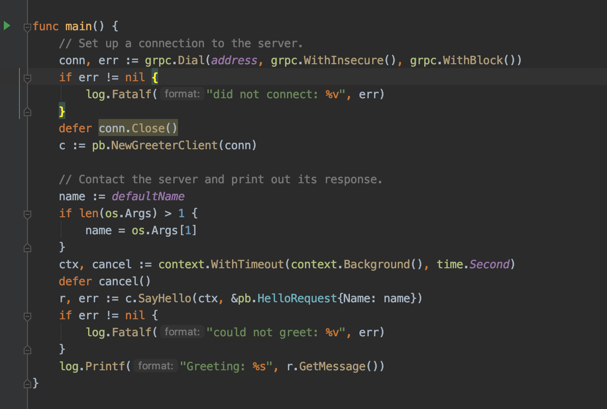
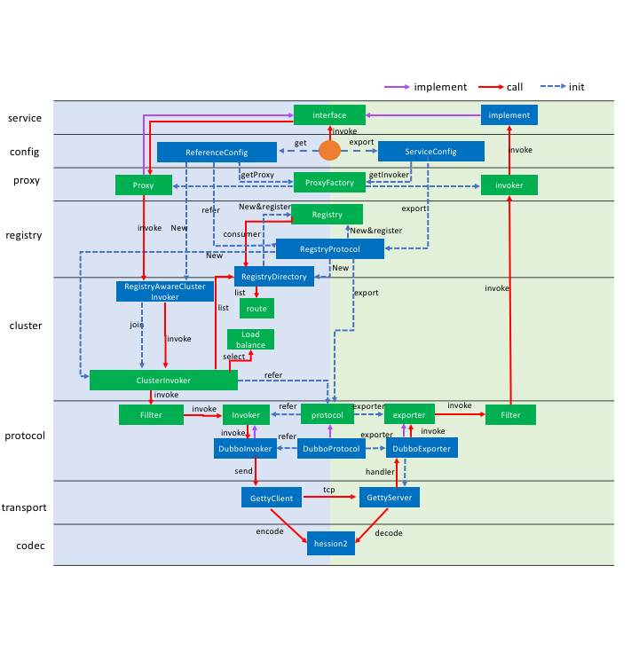
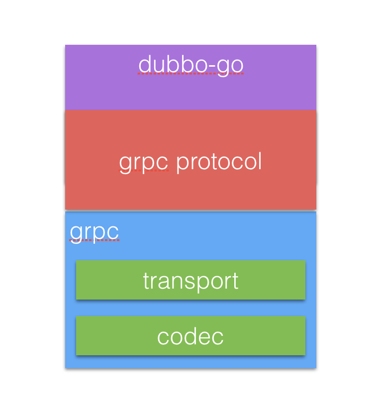
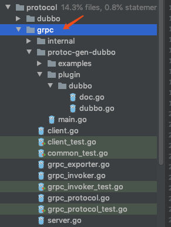
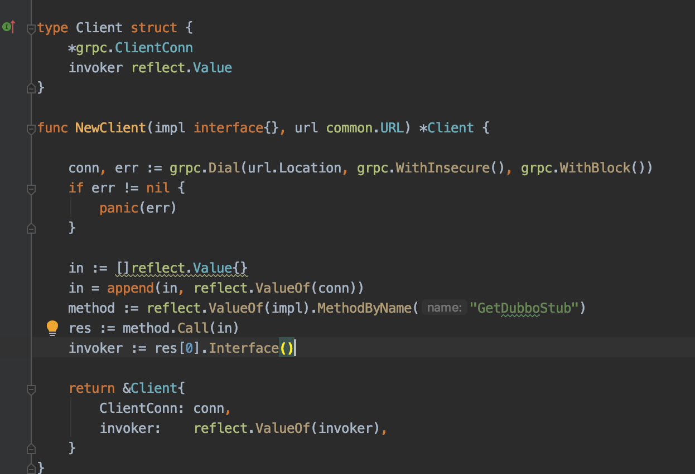

# 无缝连接dubbo-go与gRPC

最近我们`dubbogo`社区里面，呼声很大的一个`feature`就是对`grpc`的支持。在某位大佬的不懈努力之下，终于弄出来了。

今天我就给大家分析一下大佬是怎么连接`dubbogo`和`grpc`。

## grpc
先来简单介绍一下`grpc`。它是`google`推出来的一个`RPC`框架。`grpc`是通过`IDL(Interface Definition Language)`——接口定义语言——编译成不同语言的客户端来实现的。可以说是`RPC`理论的一个非常非常标准的实现。

因而`grpc`天然就支持多语言。这几年，它几乎成为了跨语言`RPC`框架的标准实现方式了，很多优秀的`rpc`框架，如`Spring Cloud`和`dubbo`，都支持`grpc`。

### server端

在`go`里面，`server`端的用法是：

它的关键部分是：`s := grpc.NewServer()`和`pb.RegisterGreeterServer(s, &server{})`两个步骤。第一个步骤很容易，唯独第二个步骤`RegisterGreeterServer`有点麻烦。为什么呢？

因为`pb.RegisterGreeterServer(s, &server{})`这个方法是通过用户定义的`protobuf`编译出来的。

好在，这个编译出来的方法，本质上是：

也就是说，如果我们在`dubbogo`里面拿到这个`_Greeter_serviceDesc`，就可以实现这个`server`的注册。因此，可以看到，在`dubbogo`里面，要解决的一个关键问题就是如何拿到这个`serviceDesc`。

### client端

`client`端的用法是：

这个东西要复杂一点：
1. 创建连接：`conn, err := grpc.Dial(address, grpc.WithInsecure(), grpc.WithBlock())`
2. 创建`client`：`c := pb.NewGreeterClient(conn)`
3. 调用方法：`r, err := c.SayHello(ctx, &pb.HelloRequest{Name: name})`

第一个问题其实挺好解决的，毕竟我们可以从用户的配置里面读出`address`；

第二个问题就是最难的地方了。如同`RegisterGreeterServer`是被编译出来的那样，这个`NewGreeterClient`也是被编译出来的。

而第三个问题，乍一看是用反射就能解决，但是我们打开`SayHello`就能看到：

结合`greetClient`的定义，很容易看到，我们的关键就在于`err := c.cc.Invoke(ctx, "/helloworld.Greeter/SayHello", in, out, opts...)`。换言之，我们只需要创建出来连接，并且拿到方法、参数就能通过类似的调用来模拟出`c.SayHello`。

通过对`grpc`的简单分析，我们大概知道要怎么弄了。还剩下一个问题，就是我们的解决方案怎么和`dubbogo`结合起来呢？

## 设计

我们先来看一下`dubbogo`的整体设计，思考一下，如果我们要做`grpc`的适配，应该是在哪个层次上做适配。

我们根据前面介绍的`grpc`的相关特性可以看出来，`grpc`已经解决了`codec`和`transport`两层的问题。

而从`cluster`往上，显然`grpc`没有涉及。于是，从这个图里面我们就可以看出来，要做这种适配，那么`protocol`这一层是最合适的。即，我们可以如同`dubbo protocol`那般，扩展出来一个`grpc protocol`。

这个`grpc protocol`大体上相当于一个**适配器**，将底层的`grpc`的实现和我们自身的`dubbogo`连接在一起。

## 实现

在`dubbogo`里面，和`grpc`相关的主要是：

我们直接进去看看在`grpc`小节里面提到的要点是如何实现的。

### server端

这样看起来，还是很清晰的。如同`dubbogo`其它的`protoco`一样，先拿到`service`，而后通过`service`来拿到`serviceDesc`，完成服务的注册。

注意一下上图我红线标准的`ds, ok := service.(DubboGrpcService)`这一句。

为什么我说这个地方有点奇怪呢？是因为理论上来说，我们这里注册的这个`service`实际上就是`protobuf`编译之后生成的`grpc`服务端的那个`service`——很显然，单纯的编译一个`protobuf`接口，它肯定不会实现`DubboGrpcService`接口：

那么`ds, ok := service.(DubboGrpcService)`这一句，究竟怎么才能让它能够执行成功呢？

我会在后面给大家揭晓这个谜底。

### client端

`dubbogo`设计了自身的`Client`，作为对`grpc`里面`client`的一种模拟与封装：

注意看，这个`Client`的定义与前面`greetClient`的定义及其相似。再看下面的`NewClient`方法，里面也无非就是创建了连接`conn`，而后利用`conn`里创建了一个`Client`实例。

注意的是，这里面维护的`invoker`实际上是一个`stub`。

当真正发起调用的时候：

红色框框框住的就是关键步骤。利用反射从`invoker`——也就是`stub`——里面拿到调用的方法，而后通过反射调用。

### 代码生成

前面提到过`ds, ok := service.(DubboGrpcService)`这一句，面临的问题是如何让`protobuf`编译生成的代码能够实现`DubboGrpcService`接口呢？

有些小伙伴可能也注意到，在我贴出来的一些代码里面，反射操作会根据名字来获取`method`实例，比如`NewClint`方法里面的`method := reflect.ValueOf(impl).MethodByName("GetDubboStub")`这一句。这一句的`impl`，即指服务的实现，也是`protobuf`里面编译出来的，怎么让`protobuf`编译出来的代码里面含有这个`GetDubboStub`方法呢？

到这里，答案已经呼之欲出了：修改`protobuf`编译生成代码的逻辑！

庆幸的是，在`protobuf`里面允许我们通过插件的形式扩展我们自己的代码生成的逻辑。

所以我们只需要注册一个我们自己的插件：

然后这个插件会把我们所需要的代码给嵌入进去。比如说嵌入`GetDubboStub`方法：

还有`DubboGrpcService`接口：

这个东西，属于难者不会会者不难。就是如果你不知道可以通过`plugin`的形式来修改生成的代码，那就是真难；但是如果知道了，这个东西就很简单了——无非就是水磨工夫罢了。
