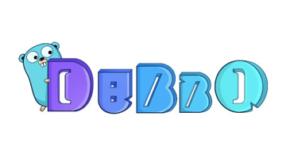

# Dubbo-go 是什么

Apache/Dubbo-go（github.com/apache/dubbo-go) 

是一款分布式 RPC 框架；是 Apache/Dubbo 的 Go 语言实现。旨在为开发者提供便利的微服务应用开发体验。

Dubbo-go 架起 Java 和 Golang 之间的桥梁，与 gRPC/Dubbo/SpringCloud 生态互联互通，配合 Go 生态享受云原生时代的技术红利。

下一章：[【RPC 调用】](../quickstart/3.0/quickstart_triple.html)
